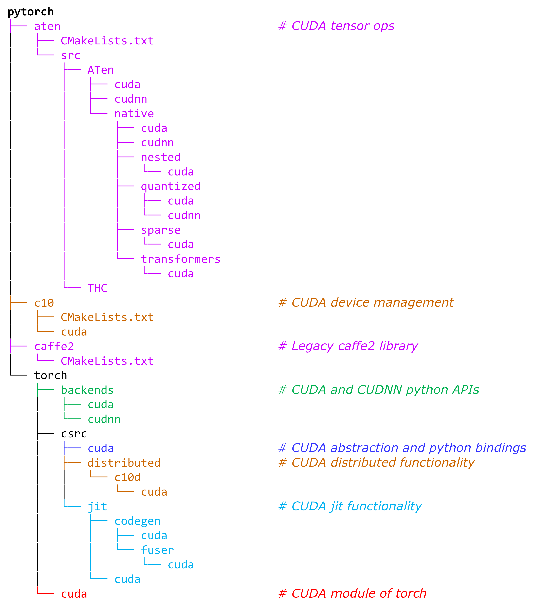
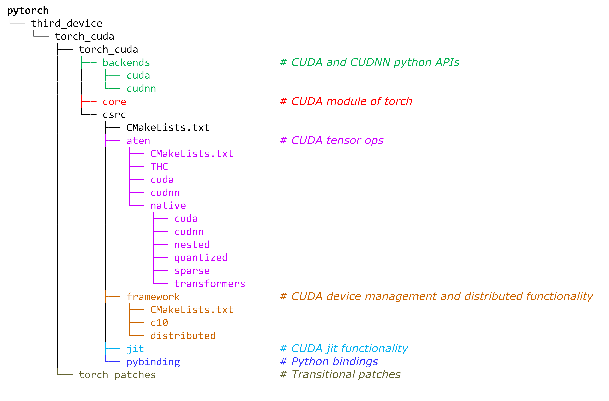
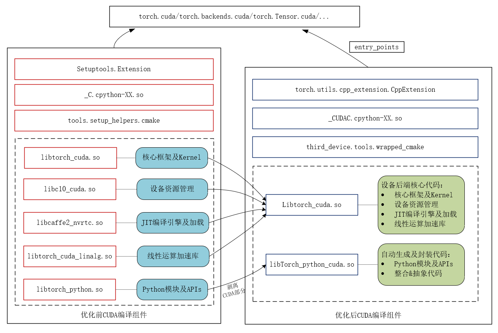

# **CUDA code decoupling and directory restructuring**

**Authors:**
- @ywwbill
- @bjtuwjx
- @jinghere11
- @bithighrr
- @treestreamymw
- @liyagit21
- @崔巍
- @leiborzhu
- @Fuzewei
- @hhong

## **Summary** （1人）王家喜
目前，第三方硬件后端接入PyTorch的方式主要包括复用CUDA key和代码逻辑、利用树内预定义的key（如AMD HIP和Intel XPU）和部分代码以及利用树内预留的PrivateUse1 key等三种。一方面，由于CUDA软件栈的生态地位，部分硬件厂商（如Kunlunxin XPU和MetaX MACA）选择直接复用CUDA key，通过兼容CUDA API的方式最小化PyTorch使用者的代码迁移成本。这种方法的优点是可以直接复用CUDA代码的逻辑，厂商适配工作量较小，但为了发挥硬件的优势，需要对CUDA kernel等代码进行侵入式修改。另一方面，随着PrivateUse1接入机制的不断完善，越来越多的厂商（如Ascend NPU和Cambricon MLU）选择此种接入方式，这种方法的优点是对PyTorch侵入修改较少，但厂商适配工作量较大（如无法直接复用CUDA代码逻辑）。

本RFC提案旨在充分融合两者的优势，弥补相互之间的不足，先将CUDA代码解耦出来，形成相对独立的代码目录结构和编译单元；而后，逐步实现CUDA硬件后端、类CUDA硬件后端和其他架构硬件后端以统一的机制接入PyTorch。

## **Highlights** （1人）袁孟雯
- 将 CUDA 相关实现从主工程中抽离，降低 PyTorch 核心框架对 CUDA 的直接耦合，提升整体工程可维护性。
- 更清晰、统一的目录层级结构，提升可读性与可维护性，使开发者能快速定位并理解后端逻辑，降低新开发者参与的学习门槛，为长期维护和社区贡献者提供更友好的结构。
- 重写构建系统以支持 CUDA 后端独立编译，降低编译复杂度，实现更快的增量构建和更少的构建依赖。
- 统一设备后端架构风格，为后续支持更多第三方后端提供模板，降低集成门槛和时间成本，提升 PyTorch 后端接入的一致性与可插拔性。

## **Motivation**（1人）祝贺
传统上，NVIDIA GPU与CUDA架构长期作为PyTorch生态中唯一的并行计算解决方案。随着越来越多的厂家推出自己的高效能计算设备，如寒武纪MLU、Graphcore IPU等，当前生态暴露出以下关键问题：
- 重复开发成本：各厂商独立开发设备适配层，导致重复编写
- 接口碎片化：不同硬件平台的API命名规则与实现方式差异显著，迫使用户维护多套设备专用代码。
- 操作复杂性：尽管部分厂商通过PrivateUse1机制实现基础接入，但设备管理语义与算子命名仍未统一
这种生态分裂现状与PyTorch硬件无关性的设计理念产生直接冲突，导致跨平台模型部署效率低下、硬件依赖性的研究复现困难、新型计算架构接入成本居高不下。

该方案的贡献：
- 抽象与标准化：对现有不同厂商的适配代码进行全面梳理，提取共性，将适配代码的命名和架构统一至PrivateUse1标准下，确保从前端到后端的一致性，减少不必要的重命名步骤。最终，让人工智能模型开发者在对设备无感的情况下使用pytorch。
- 代码复用与通用性提升：通过详细的调用栈分析，识别并抽象出如设备管理(device)、流(stream)管理、事件(event)处理等通用组件，形成一套统一的接口规范。这样，各厂商仅需关注实现这些通用接口的底层硬件特定逻辑，大幅降低适配成本和复杂度。
- 简化接入流程：建立一套标准化的接入流程指南，指导新加入的厂商如何快速、高效地基于PrivateUse1标准实现其硬件适配，确保新适配代码的高效整合与兼容性。
- 开源社区协作与生态建设：通过统一的适配模式，鼓励各厂商共享适配经验，促进技术交流，推动不同显卡生态在PyTorch框架中的成熟与发展，使得PyTorch不再是某几种GPU硬件设备的专利，而是成为高性能计算领域最通用的框架。

## **Proposed Implementation**

### 需要解耦的功能模块

纵观PyTorch代码仓库，CUDA相关代码分散放置在多个目录下。这些目录涉及PyTorch不同的功能模块，具体如下图所示：

<div style="text-align: center;">
    
    <p>Fig. 1 CUDA related directories and their functionalities</p>
</div>

我们的主要工作是将以上CUDA相关代码从各个目录剥离出来，并放置在一个重组和优化后的目录结构之下。

### 解耦方式

从代码来源而言，CUDA代码解耦主要包含文件间解耦和文件内解耦等两大类型。顾名思义，文件间解耦即是将包含CUDA代码的整个源文件从原目录迁移到新目录；而文件内解耦则主要针对包含CPU/CUDA/HIP/XPU等混合代码的文件，将文件中的CUDA代码进行分离，并将这些代码作为新的源文件或插入已有的源文件并迁移到新目录下。

#### 文件间解耦

文件级别的CUDA代码解耦可以借助文件夹名、文件名或文件名后缀来进行。

- 文件夹名称包含 `cuda`、`cudnn`、`THC` 关键字。示例：

    - `torch/backends/cuda`
    - `torch/backends/cudnn`
    - `torch/cuda`
    - `aten/src/ATen/cuda`
    - `aten/src/ATen/cudnn`
    - `aten/src/ATen/native/cuda`
    - `aten/src/ATen/native/cudnn`
    - `aten/src/ATen/native/nested/cuda`
    - `aten/src/ATen/native/quantized/cuda`
    - `aten/src/ATen/native/quantized/cudnn`
    - `aten/src/ATen/native/sparse/cuda`
    - `aten/src/ATen/native/transformers/cuda`
    - `aten/src/THC`
    - `torch/csrc/cuda`
    - `torch/csrc/distributed/c10d/cuda`

- 文件名包含`cuda`、`cudnn`、`THC` 关键字。示例：

    - `torch/csrc/distributed/rpc/tensorpipe_cuda.cpp`
    - `torch/csrc/profiler/stubs/cuda.cpp`

- 后缀名是 `.cu`、`.cuh`。示例：

    - `torch/csrc/distributed/c10d/quantization/quantization_gpu.cu`

事实上，在代码仓的构建配置文件中（如`CMakeLists.txt`和`*.bzl`），已经很好地对部分文件级别的CUDA代码进行了归类。因此，我们也可以利用这些构建配置文件来对文件级别的CUDA代码解耦进行查缺补漏。

- 示例 1：通过`build_variables.bzl`中文件划分解耦 distributed 模块 CUDA 相关代码

```cmake
# These files are the only ones that are supported on Windows.
libtorch_cuda_distributed_base_sources = [
    "torch/csrc/distributed/c10d/reducer_cuda.cpp",
]

# These files are only supported on Linux (and others) but not on Windows.
libtorch_cuda_distributed_extra_sources = [
    "torch/csrc/distributed/c10d/CudaDMAConnectivity.cpp",
    "torch/csrc/distributed/c10d/NCCLUtils.cpp",
    "torch/csrc/distributed/c10d/FlightRecorder.cpp",
    "torch/csrc/distributed/c10d/ProcessGroupNCCL.cpp",
    "torch/csrc/distributed/c10d/ProcessGroupUCC.cpp",
    "torch/csrc/distributed/c10d/UCCTracing.cpp",
    "torch/csrc/distributed/c10d/UCCUtils.cpp",
    "torch/csrc/distributed/c10d/intra_node_comm.cpp",
    "torch/csrc/distributed/c10d/intra_node_comm.cu",
    "torch/csrc/distributed/c10d/CUDASymmetricMemory.cu",
    "torch/csrc/distributed/c10d/CUDASymmetricMemoryOps.cu",
    "torch/csrc/distributed/c10d/cuda/AsyncMM.cu",
    "torch/csrc/distributed/c10d/NanCheck.cu",
    "torch/csrc/distributed/rpc/tensorpipe_cuda.cpp",
    "torch/csrc/distributed/c10d/quantization/quantization_gpu.cu",
]

libtorch_cuda_distributed_sources = libtorch_cuda_distributed_base_sources + libtorch_cuda_distributed_extra_sources
```

- 示例 2：根据`aten\src\ATen\CMakeLists.txt`中文件划分添加`aten\src\ATen\native\miopen`代码

```cmake
list(APPEND ATen_CUDA_CPP_SRCS
  ${cuda_cpp}
  ${native_cuda_cpp}
  ${native_cudnn_cpp}
  ${native_miopen_cpp}
  ${native_nested_cuda_cpp}
  ${native_quantized_cuda_cpp}
  ${native_quantized_cudnn_cpp}
  ${native_sparse_cuda_cpp}
  ${native_transformers_cuda_cpp}
)
```

#### 文件内解耦
有些cuda代码直接和torch代码耦合在一个文件内，通过环境变量、宏定义或者设备判断等隔离。
- 包含`CUDA`相关的环境变量判断. 示例：
  - `#if defined(__CUDA_ARCH__)` 存在于下列文件
    - `torch/csrc/aten/native/Distributions.h`
  - `#if defined(__CUDACC__)` 存在于下列文件
    - `torch/csrc/aten/native/sparse/Macros.h`
  - `#ifdef USE_CUDA` 存在于下列文件或者文件夹
    - `caffe2/CMakeLists.txt`
    - `torch/csrc/Storage.cpp`
    - `torch/csrc/dynamo/guards.cpp`
    - `torch/csrc/inductor/aoti_runner/pybind.cpp`
    - `torch/csrc/jit`

- 文件内包含`CUDA`相关宏定义
  - `TORCH_CUDA_CU_API`
  - `TORCH_CUDA_CPP_API`
  - `TORCH_CUDA_CHECK`

- 文件内包含 `is_cuda`、`kCUDA`、`cuda`等.示例：
```cpp
static CUDAHooksInterface* cuda_hooks = nullptr;
xxtensor.is_cuda()
xxtensor.device().type() == at::kCUDA
register_cuda_runner("cuda", &create_aoti_runner_cuda)
```

此外，为了独立编译CUDA，CUDA编译需要依赖的文件也需要进行解耦或迁移。需要补充的文件类型包括：

- `*.h`、`*.hpp` 头文件。示例：
    - `torch/csrc/autograd/functions/comm.h`

- 配置文件。示例：
    - `aten/src/ATen/ATenConfig.cmake.in` 
    - `aten/src/ATen/Config.h.in` 
    - `aten/src/ATen/native/native_functions.yaml`  
    - `aten/src/ATen/native/tags.yaml`
    - `aten/src/ATen/native/ts_native_functions.yaml`

- 模板文件。示例：
    - `aten/src/ATen/templates`

- 打桩文件。示例：
    - `torch/csrc/stub.c`

### 目录重构

CUDA代码解耦出来后，下一步便是要将其重新组织到新的目录结构下。在目录重构方面，我们首先调研了[AMD(gpu)](https://github.com/ROCm/pytorch)、[Google(TPU)](https://github.com/pytorch/xla/tree/master)、[Intel(XPU)](https://github.com/intel/intel-extension-for-pytorch)、[Ascend(NPU)](https://gitee.com/ascend/pytorch)、[Cambricon(MLU)](https://github.com/Cambricon/torch_mlu/tree/r2.4_develop)等多个超算卡厂商适配pytorch的方式，分析了各厂商适配PyTorch的代码目录结构、相似和特异性改动点。在此基础上，我们对Fig. 1所示的CUDA代码目录结构重构如Fig. 2所示。

<div style="text-align: center;">
    
    <p>Fig. 2 Restructured directories for CUDA codes</p>
</div>

下面对Fig. 2所示的重构目录进行说明。

- 在pytorch home目录下创建`third_device/`目录，用于存放第三方硬件适配PyTorch的代码。其中，CUDA适配PyTorch的代码将放在`third_device/torch_cuda`目录下。

- `third_device/torch_cuda`目录包含`third_device/torch_cuda/torch_cuda`和`third_device/torch_cuda/torch_patches`2个子目录，其中`third_device/torch_cuda/torch_cuda`目录是主体，用于存放前述解耦出来的CUDA的代码；`third_device/torch_cuda/torch_patches`目录则用于存放过渡期的一些patch（详见[Unresolved questions](#unresolved-questions)小节）。

- `third_device/torch_cuda/torch_cuda`目录下包含了python文件集合（主要包含`third_device/torch_cuda/torch_cuda/backends`和`third_device/torch_cuda/torch_cuda/core`）目录和C/C++文件集合（主要为`third_device/torch_cuda/torch_cuda/csrc`目录）。

- `third_device/torch_cuda/torch_cuda/backends`和`third_device/torch_cuda/torch_cuda/core`分别对应Fig. 1中的`torch/backends`和`torch/cuda`。

- `third_device/torch_cuda/torch_cuda/csrc`目录由`third_device/torch_cuda/torch_cuda/csrc/aten`、`third_device/torch_cuda/torch_cuda/csrc/framework`、`third_device/torch_cuda/torch_cuda/csrc/jit`和`third_device/torch_cuda/torch_cuda/csrc/framework`等4个子目录构成。

- `third_device/torch_cuda/torch_cuda/csrc/aten`对Fig. 1中的`torch/aten`和`torch/caffe2`目录进行了合并。

- `third_device/torch_cuda/torch_cuda/csrc/framework`主要由Fig. 1中的`torch/csrc/cuda`和`torch/csrc/distributed`等2部分构成。

- `third_device/torch_cuda/torch_cuda/csrc/jit`对应于Fig. 1中的`torch/csrc/jit`的CUDA实现

- 最后，`third_device/torch_cuda/torch_cuda/csrc/pybinding`目录则用于存放C++到Python接口的python bingding codes

### 编译工程优化
本方案针对PyTorch原生CUDA设备编译流程进行了以下关键性改进：

- **编译逻辑解耦**  
   将CUDA编译系统从主框架解耦为独立工程，构建两大核心组件：
  
  - `torch_cuda`  
    - 设备抽象层与运行框架  
    - 设备资源管理  
    - 算子实现（原生/native、加速库/cuBLAS/cuDNN/linalg、自定义）
  
  - `torch_python_cuda`
    - 基于pybind11的Python-C++交互接口
    - 针对新设备的跨语言类型系统桥接层，实现设备后端与Python层的双向解耦

- **CMake工程化封装**  
   基于`tools.setup_helpers.cmake`封装`wrapped_cmake`构建工具：
  
  - 标准化设备后端编译工具链
  - 实现：编译参数统一配置、环境自动初始化、编译器特性适配

- **模块化隔离架构**  
  
  - 分离出独立设备模块`_CUDAC.cpython-XX.so`，具备独立初始化链路
  - 统一新设备专用扩展构建器`torch.utils.cpp_extension.NewDeviceCppExtension`，实现编译环境与核心框架的物理隔离
  
<div style="text-align: center;">
    
    <p>图2 编译架构对比（左：原始架构，右：新架构）</p>
</div>

## 优缺点（1人）   付泽伟

## **Metrics **

理想情况下pytroch应该作为一种与硬件无关的深度学习框架，就像操作系统一样对于使用者屏蔽底层硬件实现细节，并提供经过抽象的和便于使用的接口，这些接口不应该涉及任何和底层硬件实现有关的信息。Pytorch自定义一套与底层硬件无关的硬件抽象层，统一差异化的硬件接口（集合通信），使上层系统组件无需关注具体硬件实现，同时方便各个硬件厂商对接自己的硬件。然而现实情况和上面有差异，主要是以下几点。

1. 直接指定底层硬件
   实际在使用pytorch的时候，经常涉及到在代码中直接指定底层硬件的情况，例如torch.tensor([3,4]).cuda()，假如在切换到第三方硬件后，pytorch的用户还需要对代码做不通程度的修改，而且由于缺乏硬件抽象，对于第三方的接入使用没有强制性的规定，导致用户代码在切换不同的底层硬件时所做的的修改不完全一样，给代码的通用性带来了挑战。
2. pytorch和cuda的强依赖
   pytorch源码中直接涉及到调用cuda的接口，这导致了新的cuda版本发布后，需要等pytorch官方适配，pytorch此外代码中充斥了对cuda头文件的引用，需要通过设置对应的环境变量加以屏蔽，不便于用户理解。
3. 第三方硬件接入困难
   目前pytorch提供了privateuse1的DispatechKey，为开发者提供了一种扩展硬件的方式，然后在厂商的实际使用中还是存在问题，例如1.无法同时接入两个不同的后端，2.代码的侵入性强，需要在Pytorch框架层面修改核心组件例如（storage模块，device manange模块），这导致与官方代码的耦合度高，而且无法跟随Pytorch的版本自动升级。
   我们提出的cuda代码抽象分离方案就是在看到以上问题的基础上提出的，主要具有以下的优点：
4. 对使用者屏蔽底层硬件实现
   我们自定义了一套对底层的硬件抽象层，规定了在接入第三方硬件时应该实现的接口和调用规则，在用户使用层面，用户不用直接使用cuda这样的关键字，我们自定义了一套通用的关键字（cuda对应pu1，nccl对应pccl），底层硬件改变后对用户是无感的，用户不用频繁修改代码，真正做到一套代码全平台运行。
5. 解除pytorch和cuda代码的强依赖
   我们将cuda设备视为一个和第三方硬件一样的可接入的硬件，对cuda设备的接入方式和所有第三方硬件一致，并从pytorch代码中删除了对cuda的依赖，这样pytorch的版本升级不用和cuda升级同步，给双方留下的最大的灵活性。
6. 方便接入第三方硬件
   以往的第三方硬件接入过程中，各个厂商分别实现接入代码，导致代码臃肿和功能重复，现在我们提供了硬件抽象层的基类实现，一些通用的功能已经实现完毕，并预留出了和硬件强相关的接口，各个厂商只需要按照要求实现这些接口即可实现硬件接入pytorch。由于通用了代码，当框架代码升级时第三方硬件也能自动享受框架升级带来的性能提升。

## **Drawbacks **

Are there any reasons why we should not do this? Here we aim to evaluate risk and check ourselves.

Please consider:

* is it a breaking change?
* Impact on UX
* implementation cost, both in terms of code size and complexity
* integration of this feature with other existing and planned features

## **Alternatives**   洪泓

What other designs have been considered? What is the impact of not doing this?

代码有以下两种放置方案：

1. in-tree

在Pytorch代码下新建目录pytorch/third_device/torch_cuda放入分离后代码，编译过程融       入Pytorch编译中，编译前通过patch形式对Pytorch原生代码进行修改，可以无缝集成到 PyTorch 生态系统中，和PyTorch进行同步开发和版本更新，安全性和稳定性更高，兼容性好，不需要再进行额外的代码适配和测试。

2. out-of-tree

不将代码直接集成到主代码库中，新建仓库对代码独立进行编译和维护，使用时以插件形式接入Pytorch，不对Pytorch原生代码进行侵入式修改，可以提高代码灵活性并降低代码维护成本，开发者可以在不影响主项目的情况下，自由地进行代码改进、修复漏洞和添加新功能，实现快速迭代和测试。

## **Prior Art**（1人） 崔巍

### 社区讨论
* Issue #129027（“将部分公用 API 从 torch::cuda::initModule 提取到 torch::initModule”）：讨论指出当前有一些仅与 CUDA 实现无关的公用功能（例如缓存张量开关、缓存张量管理等）被定义在 torch/csrc/cuda/Module.cpp 中解决思路是将这些与设备无关的 API 从 CUDA 初始化模块中抽取出来，放入通用的 torch 模块，以便其他设备也能复用
* Issue #131881（“解耦部分通用 API 与 CUDA 构建”）：与 #129027 类似，该提案关注将当前只能在启用 CUDA 时才暴露的通用 API（如 _set_storage_access_error_msg、_storage_Use_Count 等）移动到基础模块中问题描述中展示了一段 torch/csrc/cuda/Module.cpp 的注册代码片段，并建议“从 torch::cuda::initModule(module) 中移动到 torch::initModule()”，以实现功能与设备无关的解耦截至目前，这些讨论还处于提案阶段，主要体现了社区对将 CUDA 相关代码拆分为通用层的需求。

### 第三方厂商实践

* 寒武纪 (Cambricon)：寒武纪推出了名为 CATCH 的 PyTorch 扩展包，以支持 Cambricon MLU 设备CATCH 是独立于主 PyTorch 发行版的包，通过对原生 PyTorch 源码应用补丁（patch）的方式将寒武纪专用后端集成进去具体做法是在 PyTorch Extension 机制下，将 Cambricon 设备的 Aten 算子封装在 CATCH 中，然后借助补丁把这些算子注册到原生 PyTorch 的算子注册框架中Cambricon 的构建流程使用 CMake 脚本和 Docker 容器管理，CATCH 自身包含多卡训练和 TorchScript 图融合的支持，已实现对 MLU370 等硬件的训练/推理支持通过这种方式，PyTorch 编译时引入了 MLU 相关代码（如新增 MLU 设备类型和对应算子注册），在运行时可以选择使用 MLU 设备进行计算（类似 device="mlu"）。目前 CATCH 已能在开启补丁的 PyTorch 上支持多卡训练和 TorchScript 模式下的融合推理，但尚未形成通用动态多后端加载机制，通常需要使用特定配置的 PyTorch 二进制（带 MLU 补丁的版本）来运行。

* 摩尔线程 (MooreThreads)：摩尔线程提供了名为 torch_musa 的 PyTorch 插件包，通过 “插件化” 的方式支持其 MUSA GPU。该项目以扩展包形式发行，官方描述“以 plug-in 方式开发，使 torch_musa 与 PyTorch 解耦”实现原理是利用 PyTorch 的 PrivateUse1 设备键（PrivateUse1 预留给第三方硬件）注册“MUSA”设备类型，并通过文本转换和自定义编译工具链将 CUDA 代码适配到 MUSA。具体包括使用自研的 MUSAExtension（类似于 CUDAExtension）来构建本地扩展、使用 SimplePorting 等工具将 .cu 文件中的 cuda 替换为 musa、将依赖如 cublas 替换为 MUSA 对应的库等构建时需依赖摩尔线程提供的 MUSA 编译器（mcc）和 SDK，并可通过其脚本自动下载并编译改造后的 PyTorch 和 torch_musa。使用 torch_musa 后，用户可以像使用 CUDA 一样使用 MUSA 设备（相同的 API 调用格式），且兼容原生 PyTorch 的编程习惯实践效果方面，torch_musa 提供了对 MUSA GPU 的张量计算支持，并且声明了“实现了 CUDA 兼容性，大大减少新算子适配的工作量”目前 torch_musa 已有多个版本的轮子和源码发布，支持在不修改上层模型代码的前提下使用 MUSA 设备进行训练和推理；动态多后端切换方面，可通过设置不同的 torch.device("cuda") 或 torch.device("musa") 来选择对应硬件，但底层需要先行安装并加载相应插件版本的 PyTorch。

总体而言，Cambricon 和摩尔线程都通过插件式、补丁式改造方式实现了 CUDA 编译逻辑的拆分：前者需要维护带补丁的 PyTorch 分支，后者则在保持主 PyTorch 源兼容的基础上提供独立扩展包，两者都在实践中支持了各自设备的动态加载与调用。

## **Unresolved questions**
由于PyTorch 原生代码所存在的一些待解决问题，以及构建流程的变化，我们需要对一些未分离的代码（也即非CUDA代码）进行少量的改动。为避免直接对Pytorch代码进行侵入式修改，我们将这些改动作为patch并统一放置在`third_device/torch_cuda/torch_patches`目录下作为过渡性的解决方案。在构建开始之前，我们应先apply这些patch。

下面给出patch的两个例子。

- Example 1：由于我们将构建拆分为了torch_cpu和torch_cuda两个阶段。在torch_cpu阶段，`USE_CUDA`环境变量将关闭，也即只编译非CUDA代码。由于kineto库的设计缺陷（https://github.com/pytorch/pytorch/blob/fea7e9dd37c02c334b130f6624af6163fde6b2ab/caffe2/CMakeLists.txt#L1624），使得我们在编译torch_cpu阶段，也需要将torch_cpu链接到cudart。因此，我们需要对`caffe2/CMakeLists.txt`增加下面的patch：
```patch
+if(USE_KINETO AND NOT MSVC AND NOT LIBKINETO_NOCUPTI)
+  find_package(CUDA REQUIRED)
+  target_link_libraries(torch_cpu PRIVATE ${CUDA_CUDART_LIBRARY})
+endif()
```

- Example 2：在原来的单阶段构建框架下，所有的cpu和CUDA API都编译为_C动态库中；而在2阶段构建框架下，CUDA相关的API将编译为_CUDAC动态库。因此，通过Python访问CUDA API的方式将发生一些变化。例如，对于`torch/_dynamo/device_interface.py`这个文件我们需要增加下面的patch：
```patch
 get_cuda_stream: Optional[Callable[[int], int]]
 if torch.cuda._is_compiled():
-    from torch._C import _cuda_getCurrentRawStream as get_cuda_stream
+    from torch.cuda._CUDAC import _cuda_getCurrentRawStream as get_cuda_stream
 else:
     get_cuda_stream = None
```

我们期待通过PyTorch社区的群策群力，能最终消除这些patch。

## Next Steps（1人）侯丽亚

Will implement it. 

Phase 1: 代码解耦与目录重构 (预计周期: 2个月)

1. 核心模块解耦
  - 完成 `aten/src/ATen/cuda` 和 `c10/cuda` 的代码分离，建立独立编译单元
  - 重构 `torch/csrc/cuda` 的 Python-C++ 绑定层，确保与核心框架解耦
  - 验证分布式 (`distributed/c10d/cuda`) 和性能分析 (`profiler/stubs/cuda`) 模块的插件化可行性
2. 目录结构调整
  - 迁移 CUDA 相关代码至新目录结构（如 `csrc/framework/cuda`）
  - 标准化 backends/ 下的 Python 接口，统一命名规范（如 `torch.backends.pu1` 替代 `torch.backends.cuda`）
3. 构建系统适配
  - 实现 torch_cuda 和 torch_python_cuda 的独立 CMake 工程
  - 统一新设备专用扩展构建器 `torch.utils.cpp_extension.NewDeviceCppExtension` ，支持多后端编译隔离

Phase 2: 兼容性测试与第三方硬件接入 (预计周期: 1个月)

1. 向后兼容性保障
  - 维护 torch.cuda.* 的临时别名，通过 Deprecation Warning 引导用户迁移至 torch.pu1.*
  - 测试现有 CUDA 模型的兼容性（重点验证 is_cuda() 等调用的替换逻辑）
  - 编写《硬件后端接入指南》
2. 第三方厂商协作
  - 与 moer 等厂商合作，验证 PrivateUse1 接入路径的可行性
  - 编写《硬件后端接入指南》

#### Tracking issue

<github issue URL>

* 主跟踪任务: #[GitHub Issue Number]
* 子任务拆分:
  - 代码解耦: #[Sub-Issue 1]
  - 构建系统: #[Sub-Issue 2]
  - 文档更新: #[Sub-Issue 3]

#### Exceptions

Not implementing on project X now. Will revisit the decision in 1 year.
