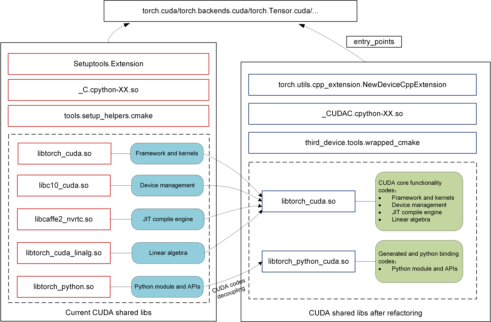

# **CUDA code decoupling and directory restructuring**

**Authors:**
- @ywwbill
- @bjtuwjx
- @jinghere11
- @bithighrr
- @treestreamymw
- @liyagit21
- @deadsec1994
- @leiborzhu
- @Fuzewei
- @aaacaiji

## **Summary**  

Currently, third-party hardware backends primarily integrate with PyTorch through three methods:
- reusing the CUDA key and its code logic (e.g., [Kunlunxin XPU](https://gitee.com/kunlunxin/pytorch) and [MetaX MACA](https://github.com/MetaX-MACA/mcPytorch/tree/2.4)),
- utilizing predefined PyTorch in-tree keys along with partial implementation codes (such as [AMD HIP](https://github.com/ROCm/pytorch) and [Intel XPU](https://github.com/intel/intel-extension-for-pytorch)),
-  leveraging the reserved PrivateUse1 key (e.g., [Ascend NPU](https://gitee.com/ascend/pytorch) and [Cambricon MLU](https://github.com/Cambricon/torch_mlu/tree/r2.4_develop)).

On one hand, due to the dominant ecosystem position of the CUDA software stack, some hardware vendors opt to directly reuse the CUDA key, achieving compatibility via CUDA APIs to minimize the code migration cost for PyTorch users. The advantage of this approach is that it allows direct reuse of CUDA code logic, resulting in relatively less integration effort for the vendors. However, to fully leverage the hardware's capabilities, invasive modifications to CUDA kernels and related code are often required. On the other hand, with the continuous improvement of the PrivateUse1 integration mechanism, an increasing number of vendors are adopting this method. Its main benefit is minimal intrusive modification to PyTorch, although it demands greater integration effort from vendors (e.g., inability to directly reuse CUDA code logic).

This RFC proposal aims to fully integrate the strengths of both approaches while addressing their respective shortcomings. The plan is to first decouple the CUDA code, establishing a relatively independent directory structure and compilation units. Subsequently, we will gradually enable unified integration mechanisms for the CUDA hardware backend, CUDA-like hardware backends, and other hardware backends with different architectures into PyTorch.

## **Highlights**  

- Decouple CUDA-related code from the main codebase to reduce the direct dependency of the PyTorch core framework code on CUDA, thereby improving overall code maintainability and modularity.
- Refine the directory hierarchy to make it clearer and more consistent, enhancing code readability and maintainability. This enables developers to quickly locate and understand backend integration logic, lowers the onboarding barrier for new contributors, and provides a more developer-friendly structure for long-term maintenance and community contributions.
- Redesign the build system to support standalone compilation of the CUDA backend, simplifying the build process, reducing dependencies, and enabling faster incremental builds.
- Provide a consistent template for integrating new third-party hardware backends. This reduces integration complexity and time-to-market, while enhancing consistency and pluggability across the PyTorch backend integration mechanism.

## **Motivation**（1人）祝贺
传统上，NVIDIA GPU与CUDA架构长期作为PyTorch生态中唯一的并行计算解决方案。随着越来越多的厂家推出自己的高效能计算设备，如寒武纪MLU、Graphcore IPU等，当前生态暴露出以下关键问题：
- 重复开发成本：各厂商独立开发设备适配层，导致重复编写
- 接口碎片化：不同硬件平台的API命名规则与实现方式差异显著，迫使用户维护多套设备专用代码。
- 操作复杂性：尽管部分厂商通过PrivateUse1机制实现基础接入，但设备管理语义与算子命名仍未统一
这种生态分裂现状与PyTorch硬件无关性的设计理念产生直接冲突，导致跨平台模型部署效率低下、硬件依赖性的研究复现困难、新型计算架构接入成本居高不下。

该方案的贡献：
- 抽象与标准化：对现有不同厂商的适配代码进行全面梳理，提取共性，将适配代码的命名和架构统一至PrivateUse1标准下，确保从前端到后端的一致性，减少不必要的重命名步骤。最终，让人工智能模型开发者在对设备无感的情况下使用pytorch。
- 代码复用与通用性提升：通过详细的调用栈分析，识别并抽象出如设备管理(device)、流(stream)管理、事件(event)处理等通用组件，形成一套统一的接口规范。这样，各厂商仅需关注实现这些通用接口的底层硬件特定逻辑，大幅降低适配成本和复杂度。
- 简化接入流程：建立一套标准化的接入流程指南，指导新加入的厂商如何快速、高效地基于PrivateUse1标准实现其硬件适配，确保新适配代码的高效整合与兼容性。
- 开源社区协作与生态建设：通过统一的适配模式，鼓励各厂商共享适配经验，促进技术交流，推动不同显卡生态在PyTorch框架中的成熟与发展，使得PyTorch不再是某几种GPU硬件设备的专利，而是成为高性能计算领域最通用的框架。

## **Proposed Implementation**

### Current directory structure of CUDA-related code

Looking across the PyTorch codebase, CUDA-related code is scattered across multiple directories. These directories span various functional modules of PyTorch, as illustrated in Fig. 1 below:

<p align="center">
    <br>
    <em>Fig. 1 CUDA related directories and their functionalities</em>
</p>

Our main task is to extract the above-mentioned CUDA-related code from their respective directories and reorganize them under a redesigned and optimized directory structure.

### Decoupling approaches

In terms of code origin, decoupling CUDA code primarily involves two levels: inter-file level decoupling and intra-file level decoupling. As the names suggest, inter-file decoupling refers to moving entire source files containing CUDA code from their original directories to new ones. In contrast, intra-file decoupling focuses on files that contain mixed code for CPU, CUDA, HIP, XPU, etc., where the CUDA-specific portions are separated out—either forming new files or being inserted into existing ones.

#### Inter-file level decoupling

The inter-file level CUDA code decoupling can be done with the help of directory names, file names, or file name suffixes.

- Directory names containing the words `cuda`, `cudnn`, or `THC`, etc. For example:

    - `torch/backends/cuda`
    - `torch/backends/cudnn`
    - `torch/cuda`
    - `aten/src/ATen/cuda`
    - `aten/src/ATen/cudnn`
    - `aten/src/ATen/native/cuda`
    - `aten/src/ATen/native/cudnn`
    - `aten/src/ATen/native/nested/cuda`
    - `aten/src/ATen/native/quantized/cuda`
    - `aten/src/ATen/native/quantized/cudnn`
    - `aten/src/ATen/native/sparse/cuda`
    - `aten/src/ATen/native/transformers/cuda`
    - `aten/src/THC`
    - `torch/csrc/cuda`
    - `torch/csrc/distributed/c10d/cuda`

- File names containing the words `cuda`, `cudnn`, or `THC`, etc. For example:

    - `torch/csrc/distributed/rpc/tensorpipe_cuda.cpp`
    - `torch/csrc/profiler/stubs/cuda.cpp`

- File name suffixes are `.cu`, `.cuh`, etc. For example:

    - `torch/csrc/distributed/c10d/quantization/quantization_gpu.cu`

In fact, some file-level CUDA code has already been well categorized by the build configuration files (such as `CMakeLists.txt` and `*.bzl`) in the codebase. Therefore, we can also leverage these build configuration files to help identify and collect inter-file level CUDA code.

- Example 1：using `aten\src\ATen\CMakeLists.txt` to decouple CUDA code within the directory of `aten\src\ATen\native\miopen`

```cmake
list(APPEND ATen_CUDA_CPP_SRCS
  ${cuda_cpp}
  ${native_cuda_cpp}
  ${native_cudnn_cpp}
  ${native_miopen_cpp}
  ${native_nested_cuda_cpp}
  ${native_quantized_cuda_cpp}
  ${native_quantized_cudnn_cpp}
  ${native_sparse_cuda_cpp}
  ${native_transformers_cuda_cpp}
)
```

- Example 2：using `build_variables.bzl` to decouple CUDA code for the distributed functionality module

```cmake
# These files are the only ones that are supported on Windows.
libtorch_cuda_distributed_base_sources = [
    "torch/csrc/distributed/c10d/reducer_cuda.cpp",
]

# These files are only supported on Linux (and others) but not on Windows.
libtorch_cuda_distributed_extra_sources = [
    "torch/csrc/distributed/c10d/CudaDMAConnectivity.cpp",
    "torch/csrc/distributed/c10d/NCCLUtils.cpp",
    "torch/csrc/distributed/c10d/FlightRecorder.cpp",
    "torch/csrc/distributed/c10d/ProcessGroupNCCL.cpp",
    "torch/csrc/distributed/c10d/ProcessGroupUCC.cpp",
    "torch/csrc/distributed/c10d/UCCTracing.cpp",
    "torch/csrc/distributed/c10d/UCCUtils.cpp",
    "torch/csrc/distributed/c10d/intra_node_comm.cpp",
    "torch/csrc/distributed/c10d/intra_node_comm.cu",
    "torch/csrc/distributed/c10d/CUDASymmetricMemory.cu",
    "torch/csrc/distributed/c10d/CUDASymmetricMemoryOps.cu",
    "torch/csrc/distributed/c10d/cuda/AsyncMM.cu",
    "torch/csrc/distributed/c10d/NanCheck.cu",
    "torch/csrc/distributed/rpc/tensorpipe_cuda.cpp",
    "torch/csrc/distributed/c10d/quantization/quantization_gpu.cu",
]

libtorch_cuda_distributed_sources = libtorch_cuda_distributed_base_sources + libtorch_cuda_distributed_extra_sources
```

#### Intra-file level decoupling

Some CUDA code is directly coupled with common code or code for other device backends within the same file. This requires identification and decoupling via flags such as environment variables, macro definitions, or CUDA-named codes.

- Environment variables or macro definitions
  - Macro `#if defined(__CUDA_ARCH__)`, such as in file:
    - `torch/csrc/aten/native/Distributions.h`
  - Macro `#if defined(__CUDACC__)`, such as in file:
    - `torch/csrc/aten/native/sparse/Macros.h`
  - Macro `#ifdef USE_CUDA`, such as in file (or directory):
    - `caffe2/CMakeLists.txt`
    - `torch/csrc/Storage.cpp`
    - `torch/csrc/dynamo/guards.cpp`
    - `torch/csrc/inductor/aoti_runner/pybind.cpp`
    - `torch/csrc/jit`
  - Other macros include `TORCH_CUDA_CU_API`, `TORCH_CUDA_CPP_API`, `TORCH_CUDA_CHECK`

- CUDA-named codes
  - Function `is_cuda`, backend key `kCUDA`, or device type `cuda`, such as：
  ```cpp
  static CUDAHooksInterface* cuda_hooks = nullptr;
  xxtensor.is_cuda()
  xxtensor.device().type() == at::kCUDA
  register_cuda_runner("cuda", &create_aoti_runner_cuda)
  ```

Moreover, to enable standalone compilation of CUDA code, files required by CUDA compilation also need to be decoupled or migrated. The types of files that need to be supplemented include:

- `*.h`、`*.hpp` header files, such as:
    - `torch/csrc/autograd/functions/comm.h`

- Configuration files, such as:
    - `aten/src/ATen/ATenConfig.cmake.in` 
    - `aten/src/ATen/Config.h.in` 
    - `aten/src/ATen/native/native_functions.yaml`  
    - `aten/src/ATen/native/tags.yaml`
    - `aten/src/ATen/native/ts_native_functions.yaml`

- Template files, such as:
    - `aten/src/ATen/templates`

- Stub files, such as:
    - `torch/csrc/stub.c`

### Directory restructuring

After decoupling the CUDA code, the next step is to reorganize it into a new directory structure. Regarding directory restructuring, we first investigated the approaches used by several hardware vendors—such as [AMD (ROCm)](https://github.com/ROCm/pytorch), [Google (TPU)](https://github.com/pytorch/xla/tree/master), [Intel (XPU)](https://github.com/intel/intel-extension-for-pytorch), [Ascend (NPU)](https://gitee.com/ascend/pytorch), and [Cambricon (MLU)](https://github.com/Cambricon/torch_mlu/tree/r2.4_develop) to adapt PyTorch to their hardwares. We analyzed their codebase directory structures, as well as the commonalities and specific modifications made during integration. Based on the analysis, we restructured the CUDA code directory layout shown in Fig. 1 into the new design as illustrated in Fig. 2.

<p align="center">
  <br>
  <em>Fig. 2 Restructured directories for CUDA codes</em>
</p>

In the following, we shall give an introduction to the restructured directory hierarchy (see Fig. 2).

- Create a `third_device/` directory under the PyTorch home directory to store code for third-party hardware backends integrating with PyTorch. The code for CUDA's integration with PyTorch will be placed under the `third_device/torch_cuda` directory.

- The `third_device/torch_cuda` directory contains two subdirectories: `third_device/torch_cuda/torch_cuda` and `third_device/torch_cuda/torch_patches`. The `third_device/torch_cuda/torch_cuda` directory is the main one, used to store the CUDA code decoupled as described earlier; the `third_device/torch_cuda/torch_patches` directory is used to store temporary patches during the transition period (see [Unresolved Questions](#unresolved-questions) section for details).

- The `third_device/torch_cuda/torch_cuda` directory contains a collection of Python files (composed of two sub-directories `third_device/torch_cuda/torch_cuda/backends` and `third_device/torch_cuda/torch_cuda/core`) and  a collection of C/C++ files (mainly located in the `third_device/torch_cuda/torch_cuda/csrc` directory).

- The `third_device/torch_cuda/torch_cuda/backends` directory and `third_device/torch_cuda/torch_cuda/core` directory correspond to `torch/backends` directory and `torch/cuda` directory in Fig. 1, respectively.

- The `third_device/torch_cuda/torch_cuda/csrc` directory consists of four sub-directories: `third_device/torch_cuda/torch_cuda/csrc/aten`, `third_device/torch_cuda/torch_cuda/csrc/framework`, `third_device/torch_cuda/torch_cuda/csrc/jit`, and `third_device/torch_cuda/torch_cuda/csrc/framework`.

- The `third_device/torch_cuda/torch_cuda/csrc/aten` directory merges the two directories of `torch/aten` and `torch/caffe2` in Fig. 1.

- The `third_device/torch_cuda/torch_cuda/csrc/framework` directory is mainly composed of `torch/csrc/cuda` and `torch/csrc/distributed` directories shown in Fig. 1.

- The `third_device/torch_cuda/torch_cuda/csrc/jit` directory corresponds to the CUDA-specific portion in `torch/csrc/jit` directory presented in Fig. 1.

- Finally, the `third_device/torch_cuda/torch_cuda/csrc/pybinding` directory is used to store the Python binding codes from C/C++ to Python.

### Project building optimization

This RFC proposal has made the following key improvements/changes to the native PyTorch CUDA device build process.

- *Standalone build project for CUDA*. We decouple the building process for CUDA as a standalone project, and outcomes two main components:
  - `torch_cuda`  
    - Framework and kernels  
    - Device management  
    - JIT compile engine
    - Linear algebra
  - `torch_python_cuda`
    - Python module and APIs

- *Wrapped cmake toolkit*. We wrap and develop a `wrapped_cmake` build tool based on `tools.setup_helpers.cmake`.
  - A standard build toolkit for PyTorch backend integration
  - Achieving unified configuration of compilation parameters, automatic environment initialization, and compiler feature adaptation

- *Better modularization*.
  - Decoupling CUDA module `_CUDAC.cpython-XX.so` that can be independently initialized
  - Unifying the dedicated extension builder `torch.utils.cpp_extension.NewDeviceCppExtension` for new backends
  
<p align="center">
    <br>
    <em>Fig. 3 CUDA codes building (left: current; right: refactored)</em>
</p>

## **Metrics** 付泽伟

理想情况下pytroch应该作为一种与硬件无关的深度学习框架，就像操作系统一样对于使用者屏蔽底层硬件实现细节，并提供经过抽象的和便于使用的接口，这些接口不应该涉及任何和底层硬件实现有关的信息。Pytorch自定义一套与底层硬件无关的硬件抽象层，统一差异化的硬件接口（集合通信），使上层系统组件无需关注具体硬件实现，同时方便各个硬件厂商对接自己的硬件。然而现实情况和上面有差异，主要是以下几点。

1. 直接指定底层硬件
   实际在使用pytorch的时候，经常涉及到在代码中直接指定底层硬件的情况，例如`torch.tensor([3,4]).cuda()`，假如在切换到第三方硬件后，pytorch的用户还需要对代码做不通程度的修改，而且由于缺乏硬件抽象，对于第三方的接入使用没有强制性的规定，导致用户代码在切换不同的底层硬件时所做的的修改不完全一样，给代码的通用性带来了挑战。
2. pytorch和cuda的强依赖
   pytorch源码中直接涉及到调用cuda的接口，这导致了新的cuda版本发布后，需要等pytorch官方适配，pytorch此外代码中充斥了对cuda头文件的引用，需要通过设置对应的环境变量加以屏蔽，不便于用户理解。
3. 第三方硬件接入困难
   目前pytorch提供了privateuse1的DispatechKey，为开发者提供了一种扩展硬件的方式，然后在厂商的实际使用中还是存在问题，例如1.无法同时接入两个不同的后端，2.代码的侵入性强，需要在Pytorch框架层面修改核心组件例如（storage模块，device manange模块），这导致与官方代码的耦合度高，而且无法跟随Pytorch的版本自动升级。
   我们提出的cuda代码抽象分离方案就是在看到以上问题的基础上提出的，主要具有以下的优点：
4. 对使用者屏蔽底层硬件实现
   我们自定义了一套对底层的硬件抽象层，规定了在接入第三方硬件时应该实现的接口和调用规则，在用户使用层面，用户不用直接使用cuda这样的关键字，我们自定义了一套通用的关键字（cuda对应pu1，nccl对应pccl），底层硬件改变后对用户是无感的，用户不用频繁修改代码，真正做到一套代码全平台运行。
5. 解除pytorch和cuda代码的强依赖
   我们将cuda设备视为一个和第三方硬件一样的可接入的硬件，对cuda设备的接入方式和所有第三方硬件一致，并从pytorch代码中删除了对cuda的依赖，这样pytorch的版本升级不用和cuda升级同步，给双方留下的最大的灵活性。
6. 方便接入第三方硬件
   以往的第三方硬件接入过程中，各个厂商分别实现接入代码，导致代码臃肿和功能重复，现在我们提供了硬件抽象层的基类实现，一些通用的功能已经实现完毕，并预留出了和硬件强相关的接口，各个厂商只需要按照要求实现这些接口即可实现硬件接入pytorch。由于通用了代码，当框架代码升级时第三方硬件也能自动享受框架升级带来的性能提升。

## **Drawbacks** 付泽伟

Are there any reasons why we should not do this? Here we aim to evaluate risk and check ourselves.

Please consider:

* is it a breaking change?
* Impact on UX
* implementation cost, both in terms of code size and complexity
* integration of this feature with other existing and planned features

## **Alternatives**

There are two possible placement strategies for the decoupled CUDA code:

- In-tree

  Create a new directory `pytorch/third_device/torch_cuda` within the PyTorch codebase to place the separated code. The build process is integrated into the PyTorch build system. Before compilation, modifications to the native PyTorch code are applied in the form of patches. This approach enables seamless integration into the PyTorch ecosystem, allowing synchronized development and version updates with PyTorch. It offers higher security, better stability, strong compatibility, and eliminates the need for additional code adaptation and testing.

- Out-of-tree

  The decoupled code is not directly integrated into the PyTorch main codebase. Instead, a separate repository is created to independently place the code. It is plugged into PyTorch as a plugin when used, without making invasive modifications to the native PyTorch code. This approach enhances code flexibility and reduces maintenance costs. Developers can freely improve the code, fix bugs, and add new features without affecting the PyTorch main project, thus enabling rapid iteration and testing.

## **Prior Art**（1人） 崔巍

### 社区讨论
* Issue #129027（“将部分公用 API 从 torch::cuda::initModule 提取到 torch::initModule”）：讨论指出当前有一些仅与 CUDA 实现无关的公用功能（例如缓存张量开关、缓存张量管理等）被定义在 torch/csrc/cuda/Module.cpp 中解决思路是将这些与设备无关的 API 从 CUDA 初始化模块中抽取出来，放入通用的 torch 模块，以便其他设备也能复用
* Issue #131881（“解耦部分通用 API 与 CUDA 构建”）：与 #129027 类似，该提案关注将当前只能在启用 CUDA 时才暴露的通用 API（如 _set_storage_access_error_msg、_storage_Use_Count 等）移动到基础模块中问题描述中展示了一段 torch/csrc/cuda/Module.cpp 的注册代码片段，并建议“从 torch::cuda::initModule(module) 中移动到 torch::initModule()”，以实现功能与设备无关的解耦截至目前，这些讨论还处于提案阶段，主要体现了社区对将 CUDA 相关代码拆分为通用层的需求。

### 第三方厂商实践

* 寒武纪 (Cambricon)：寒武纪推出了名为 CATCH 的 PyTorch 扩展包，以支持 Cambricon MLU 设备CATCH 是独立于主 PyTorch 发行版的包，通过对原生 PyTorch 源码应用补丁（patch）的方式将寒武纪专用后端集成进去具体做法是在 PyTorch Extension 机制下，将 Cambricon 设备的 Aten 算子封装在 CATCH 中，然后借助补丁把这些算子注册到原生 PyTorch 的算子注册框架中Cambricon 的构建流程使用 CMake 脚本和 Docker 容器管理，CATCH 自身包含多卡训练和 TorchScript 图融合的支持，已实现对 MLU370 等硬件的训练/推理支持通过这种方式，PyTorch 编译时引入了 MLU 相关代码（如新增 MLU 设备类型和对应算子注册），在运行时可以选择使用 MLU 设备进行计算（类似 device="mlu"）。目前 CATCH 已能在开启补丁的 PyTorch 上支持多卡训练和 TorchScript 模式下的融合推理，但尚未形成通用动态多后端加载机制，通常需要使用特定配置的 PyTorch 二进制（带 MLU 补丁的版本）来运行。

* 摩尔线程 (MooreThreads)：摩尔线程提供了名为 torch_musa 的 PyTorch 插件包，通过 “插件化” 的方式支持其 MUSA GPU。该项目以扩展包形式发行，官方描述“以 plug-in 方式开发，使 torch_musa 与 PyTorch 解耦”实现原理是利用 PyTorch 的 PrivateUse1 设备键（PrivateUse1 预留给第三方硬件）注册“MUSA”设备类型，并通过文本转换和自定义编译工具链将 CUDA 代码适配到 MUSA。具体包括使用自研的 MUSAExtension（类似于 CUDAExtension）来构建本地扩展、使用 SimplePorting 等工具将 .cu 文件中的 cuda 替换为 musa、将依赖如 cublas 替换为 MUSA 对应的库等构建时需依赖摩尔线程提供的 MUSA 编译器（mcc）和 SDK，并可通过其脚本自动下载并编译改造后的 PyTorch 和 torch_musa。使用 torch_musa 后，用户可以像使用 CUDA 一样使用 MUSA 设备（相同的 API 调用格式），且兼容原生 PyTorch 的编程习惯实践效果方面，torch_musa 提供了对 MUSA GPU 的张量计算支持，并且声明了“实现了 CUDA 兼容性，大大减少新算子适配的工作量”目前 torch_musa 已有多个版本的轮子和源码发布，支持在不修改上层模型代码的前提下使用 MUSA 设备进行训练和推理；动态多后端切换方面，可通过设置不同的 torch.device("cuda") 或 torch.device("musa") 来选择对应硬件，但底层需要先行安装并加载相应插件版本的 PyTorch。

总体而言，Cambricon 和摩尔线程都通过插件式、补丁式改造方式实现了 CUDA 编译逻辑的拆分：前者需要维护带补丁的 PyTorch 分支，后者则在保持主 PyTorch 源兼容的基础上提供独立扩展包，两者都在实践中支持了各自设备的动态加载与调用。

## **Unresolved Questions**

Due to some unresolved issues in the native PyTorch codebase and changes in the build process, we need to make minor modifications to certain code that has not been decoupled (i.e., non-CUDA code). To avoid making intrusive changes directly to the PyTorch codebase, we have placed these modifications as patches in the `third_device/torch_cuda/torch_patches` directory as a transitional solution. These patches should be applied before the build process begins.

Below are two examples of patches.

- Example 1: Since we have split the build process into two stages: torch_cpu stage and torch_cuda stage, the `USE_CUDA` flag will be disabled during the torch_cpu stage, meaning only non-CUDA code is compiled. However, due to [a design limitation of the Kineto library](https://github.com/pytorch/pytorch/blob/fea7e9dd37c02c334b130f6624af6163fde6b2ab/caffe2/CMakeLists.txt#L1624), the torch_cpu build stage still requires linking against cudart. Therefore, we need to apply the following patch to file `caffe2/CMakeLists.txt`:
```patch
+if(USE_KINETO AND NOT MSVC AND NOT LIBKINETO_NOCUPTI)
+  find_package(CUDA REQUIRED)
+  target_link_libraries(torch_cpu PRIVATE ${CUDA_CUDART_LIBRARY})
+endif()
```

- Example 2: In the original single-stage build framework, all CPU and CUDA APIs are compiled into the `_C` shared lib. However, in the two-stage build framework, CUDA-related APIs will be compiled into a separate `_CUDAC` shared lib. As a result, the way Python accesses CUDA APIs will change. For example, we need to apply the following patch to file `torch/_dynamo/device_interface.py`:
```patch
 get_cuda_stream: Optional[Callable[[int], int]]
 if torch.cuda._is_compiled():
-    from torch._C import _cuda_getCurrentRawStream as get_cuda_stream
+    from torch.cuda._CUDAC import _cuda_getCurrentRawStream as get_cuda_stream
 else:
     get_cuda_stream = None
```

We hope that, with the collective effort of the PyTorch community, these patches can eventually be eliminated.

## **Next Steps**

Implementing this RFC proposal is a two-phase process. In the short term (phase 1), we shall implement code decoupling and directory restructuring for the CUDA backend. In the long term (phase 1), we will integrate more new backends using the proposed plan.

*Phase 1*: CUDA code decoupling and directory restructuring
- CUDA code decoupling
  - CUDA C/C++ code decoupling
  - Python binding code decoupling
  - Python code decoupling
- Directory restructuring
  - Migrate decoupled code into new directory hierarchy
  - Supplement necessary header/source/configuration code
- Building system refactoring
  - Develop wrapped cmake toolkit
  - Make standalone build project for CUDA
  - Implement dedicated extension builder

*Phase 2*: More third-party hardware backends integration
- Intreating third-party hardware backends into PyTorch using CUDA key based on the decoupled methodology
- Unifying the integration of CUDA backends and other backends using the same key (e.g., PrivateUse1 key)
