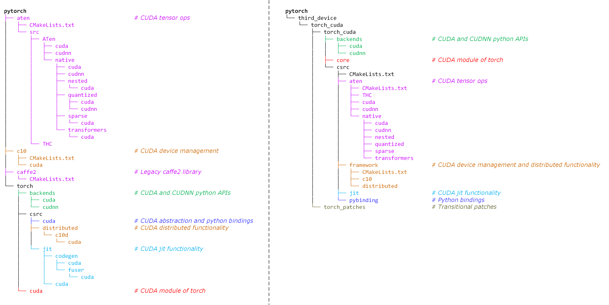
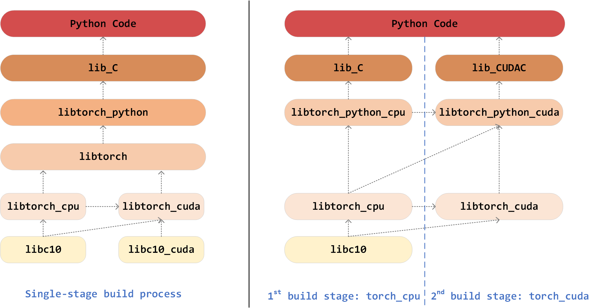
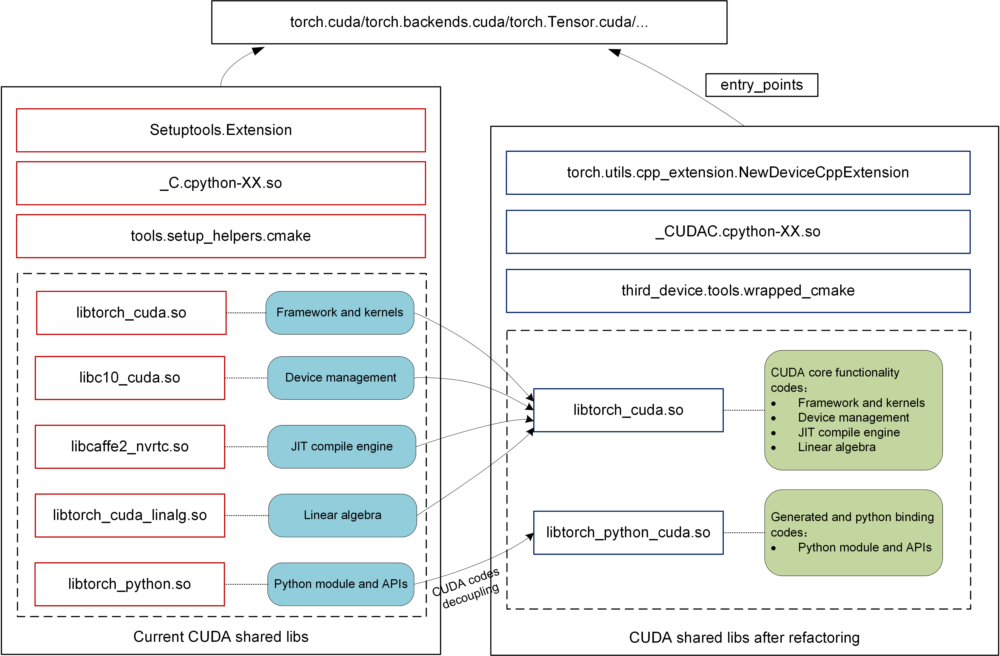

# **CUDA code decoupling and directory refactoring**

**Authors:**
- @bjtuwjx
- @jinghere11
- @bithighrr
- @treestreamymw
- @liyagit21
- @ywwbill
- @deadsec1994
- @leiborzhu
- @Fuzewei
- @aaacaiji

## **Summary** 

This RFC proposal aims to decouple the CUDA-related code from the PyTorch main codebase and refactor it into an independent and modularized directory hierarchy with the help of a build optimization toolkit. Specifically, the proposal covers the following work:
- Decouple CUDA-related code from the main codebase at both inter-file and intra-file levels, reducing the PyTorch core framework's direct dependency on CUDA.
- Propose a modularized and standardized directory hierarchy and consolidate all CUDA-related code within it as a reference for other third-party backend integration. 
- Redesign the build system to support standalone compilation of the CUDA backend and develop a wrapped cmake toolkit to support and streamline the build process.

## **Highlights**  

- *Decoupled CUDA code*. CUDA-related code is decoupled to reduce the direct dependency of the PyTorch core framework code on CUDA, thereby improving the overall code maintainability and modularity.
- *Enhanced code directory hierarchy*. The backend integration code directory hierarchy is refined to be clearer and more consistent, thus enhancing code readability and maintainability. This also enables developers to quickly locate and understand the backend integration logic, lowers the onboarding barrier for new contributors, and provides a more developer-friendly hierarchy for long-term maintenance and community contributions.
- *Build process optimization*. It enables standalone compilation of the CUDA backend, simplifying the build process, reducing dependencies, and accelerating incremental builds.

**Beyond that, this RFC proposal establishes a standardized workflow and mechanism for integrating third-party hardware backends into PyTorch.**

## **Motivation**

For a long time, NVIDIA GPUs and the CUDA architecture have dominated the PyTorch ecosystem. However, as an increasing number of vendors introduce their high-performance AI chips, current ecosystem is revealing the following key issues:
- *Code coupling*. The CUDA code is too tightly coupled with the PyTorch codebase, resulting in poor modularity and high maintenance costs.
- *Integration effort*. Currently, different hardware backends may adopt varying integration methods into PyTorch. The integration approaches and code lack standardization and consistency, leading to a significant amount of repetitive code and substantial integration effort.
- *Code migration*. Due to the lack of integration code specification, different hardware backends provide APIs with varying names and styles, resulting in high code migration costs for PyTorch users.

Therefore, we present this RFC proposal to address these issues.

## **Proposed Implementation**

The first step toward decoupling CUDA code is to identify and isolate it. This is challenging in the current PyTorch codebase, because CUDA-related code is scattered across multiple directories (see Fig. 1, left), files, or even mixed with CPU code within the same file. To address this, we propose a decoupling approach at both inter-file and intra-file levels, leveraging metadata such as directory names, file names, extensions, configuration files, and build flags.

After decoupling, we refactor the code into a separate modularized directory hierarchy—designed to be clean and maintainable for developers. To support standalone builds and standardized integration for third-party backends, we also provide a set of supporting toolkits.

### Decoupling approaches

Depending on the code origin, decoupling CUDA code primarily involves two levels: inter-file level decoupling and intra-file level decoupling. As the names suggest, inter-file decoupling refers to moving entire source files containing CUDA code from their original directories to new ones. In contrast, intra-file decoupling focuses on files that contain mixed code for CPU, CUDA, HIP, XPU, etc., where the CUDA-specific portions are separated out—either into new files or existing ones.

#### Inter-file level decoupling

In the PyTorch codebase, some CUDA code is located within dedicated directories or files. This organization allows for straightforward identification of CUDA code based on directory names, file names, or file name suffixes. The following examples illustrate these three scenarios:

- Directory names containing the words `cuda`, `cudnn`, or `THC`, etc. For example:

    - `torch/backends/cuda`
    - `torch/backends/cudnn`
    - `torch/cuda`
    - `aten/src/ATen/cuda`
    - `aten/src/ATen/cudnn`
    - `aten/src/ATen/native/cuda`
    - `aten/src/ATen/native/cudnn`
    - `aten/src/ATen/native/nested/cuda`
    - `aten/src/ATen/native/quantized/cuda`
    - `aten/src/ATen/native/quantized/cudnn`
    - `aten/src/ATen/native/sparse/cuda`
    - `aten/src/ATen/native/transformers/cuda`
    - `aten/src/THC`
    - `torch/csrc/cuda`
    - `torch/csrc/distributed/c10d/cuda`

- File names containing the words `cuda`, `cudnn`, or `THC`, etc. For example:

    - `torch/csrc/distributed/rpc/tensorpipe_cuda.cpp`
    - `torch/csrc/profiler/stubs/cuda.cpp`

- File name suffixes are `.cu`, `.cuh`, etc. For example:

    - `torch/csrc/distributed/c10d/quantization/quantization_gpu.cu`

In fact, some inter-file level CUDA code has already been well categorized by the build configuration files (such as `CMakeLists.txt` and `*.bzl`) in the codebase. Therefore, we can also leverage these build configuration files to help identify and collect inter-file level CUDA code.

- Example 1：Use `aten\src\ATen\CMakeLists.txt` to decouple CUDA code within the directory `aten\src\ATen\native\miopen`

```cmake
list(APPEND ATen_CUDA_CPP_SRCS
  ${cuda_cpp}
  ${native_cuda_cpp}
  ${native_cudnn_cpp}
  ${native_miopen_cpp}
  ${native_nested_cuda_cpp}
  ${native_quantized_cuda_cpp}
  ${native_quantized_cudnn_cpp}
  ${native_sparse_cuda_cpp}
  ${native_transformers_cuda_cpp}
)
```

- Example 2：Use `build_variables.bzl` to decouple CUDA code for the distributed functionality module

```cmake
# These files are only supported on Windows.
libtorch_cuda_distributed_base_sources = [
    "torch/csrc/distributed/c10d/reducer_cuda.cpp",
]

# These files are only supported on non-Windows systems.
libtorch_cuda_distributed_extra_sources = [
    "torch/csrc/distributed/c10d/CudaDMAConnectivity.cpp",
    "torch/csrc/distributed/c10d/NCCLUtils.cpp",
    "torch/csrc/distributed/c10d/FlightRecorder.cpp",
    "torch/csrc/distributed/c10d/ProcessGroupNCCL.cpp",
    "torch/csrc/distributed/c10d/ProcessGroupUCC.cpp",
    "torch/csrc/distributed/c10d/UCCTracing.cpp",
    "torch/csrc/distributed/c10d/UCCUtils.cpp",
    "torch/csrc/distributed/c10d/intra_node_comm.cpp",
    "torch/csrc/distributed/c10d/intra_node_comm.cu",
    "torch/csrc/distributed/c10d/CUDASymmetricMemory.cu",
    "torch/csrc/distributed/c10d/CUDASymmetricMemoryOps.cu",
    "torch/csrc/distributed/c10d/cuda/AsyncMM.cu",
    "torch/csrc/distributed/c10d/NanCheck.cu",
    "torch/csrc/distributed/rpc/tensorpipe_cuda.cpp",
    "torch/csrc/distributed/c10d/quantization/quantization_gpu.cu",
]

libtorch_cuda_distributed_sources = libtorch_cuda_distributed_base_sources + libtorch_cuda_distributed_extra_sources
```

#### Intra-file level decoupling

Some CUDA code is coupled with common code or code for other device backends within the same file. This requires identification and decoupling via flags such as environment variables, macro definitions, or CUDA-named codes.

- Environment variables or macro definitions
  - Macro `#if defined(__CUDA_ARCH__)`, such as in file:
    - `torch/csrc/aten/native/Distributions.h`
  - Macro `#if defined(__CUDACC__)`, such as in file:
    - `torch/csrc/aten/native/sparse/Macros.h`
  - Macro `#ifdef USE_CUDA`, such as in file (or directory):
    - `caffe2/CMakeLists.txt`
    - `torch/csrc/Storage.cpp`
    - `torch/csrc/dynamo/guards.cpp`
    - `torch/csrc/inductor/aoti_runner/pybind.cpp`
    - `torch/csrc/jit`
  - Other macros include `TORCH_CUDA_CU_API`, `TORCH_CUDA_CPP_API`, and `TORCH_CUDA_CHECK`.

- CUDA-named codes
  - Function `is_cuda`, backend key `kCUDA`, or device type `cuda`, such as:
  ```cpp
  static CUDAHooksInterface* cuda_hooks = nullptr;
  xxtensor.is_cuda()
  xxtensor.device().type() == at::kCUDA
  register_cuda_runner("cuda", &create_aoti_runner_cuda)
  ```

Moreover, to enable standalone compilation of CUDA code, dependent files also need to be decoupled or migrated. The types of files that need to be supplemented include:

- `*.h`、`*.hpp` header files, such as:
    - `torch/csrc/autograd/functions/comm.h`

- Configuration files, such as:
    - `aten/src/ATen/ATenConfig.cmake.in` 
    - `aten/src/ATen/Config.h.in` 
    - `aten/src/ATen/native/native_functions.yaml`  
    - `aten/src/ATen/native/tags.yaml`
    - `aten/src/ATen/native/ts_native_functions.yaml`

- Template files, such as:
    - `aten/src/ATen/templates`

- Stub files, such as:
    - `torch/csrc/stub.c`

### Directory refactoring

After decoupling the CUDA code, the next step is to refactor it into a new directory hierarchy. We first investigate the adaptation approaches used by several hardware vendors—such as [AMD (ROCm)](https://github.com/ROCm/pytorch), [Google (TPU)](https://github.com/pytorch/xla/tree/master), [Intel (XPU)](https://github.com/intel/intel-extension-for-pytorch), [Ascend (NPU)](https://gitee.com/ascend/pytorch), and [Cambricon (MLU)](https://github.com/Cambricon/torch_mlu/tree/r2.4_develop). We analyze their codebase directory hierarchy, as well as the commonalities and specific modifications during integration. Based on the analysis, we refactor the CUDA code directory shown (Fig. 1 (left)) into a new design (Fig. 1 (right)).

<p align="center">
    <br>
    <em>Fig. 1. CUDA related directories and their functionalities. Left: current directory hierarchy; Right: refactored directory hierarchy. Color-matched directories between left and right represent corresponding components.</em>
</p>

In the following, we shall give an introduction to the refactored directory hierarchy (see Fig. 1 (right)).

- Create a `third_device/` directory under the PyTorch home directory to store the code for third-party hardware backends integration. The code for CUDA's integration with PyTorch will be placed under the `third_device/torch_cuda` directory.

  - `third_device/torch_cuda` contains two subdirectories: `third_device/torch_cuda/torch_cuda` and `third_device/torch_cuda/torch_patches`.

    - `third_device/torch_cuda/torch_cuda` contains a collection of Python files (composed of sub-directories `third_device/torch_cuda/torch_cuda/backends` and `third_device/torch_cuda/torch_cuda/core`) and  a collection of C/C++ files (mainly located in the `third_device/torch_cuda/torch_cuda/csrc` directory).

      - `third_device/torch_cuda/torch_cuda/backends` and `third_device/torch_cuda/torch_cuda/core` in Fig. 1 (right) correspond to `torch/backends` and `torch/cuda` Fig. 1 (left), respectively.

      - `third_device/torch_cuda/torch_cuda/csrc` consists of four sub-directories: `third_device/torch_cuda/torch_cuda/csrc/aten`, `third_device/torch_cuda/torch_cuda/csrc/framework`, `third_device/torch_cuda/torch_cuda/csrc/jit`, and `third_device/torch_cuda/torch_cuda/csrc/framework`.

        - `third_device/torch_cuda/torch_cuda/csrc/aten` in Fig. 1 (right) merges `torch/aten` and `torch/caffe2` in Fig. 1 (left).

        - `third_device/torch_cuda/torch_cuda/csrc/framework` in Fig. 1 (right) is mainly composed of `torch/csrc/cuda` and `torch/csrc/distributed` in Fig. 1 (left).

        - `third_device/torch_cuda/torch_cuda/csrc/jit` in Fig. 1 (right) corresponds to the CUDA-specific portion in `torch/csrc/jit` in Fig. 1 (left).

        - `third_device/torch_cuda/torch_cuda/csrc/pybinding` stores the Python binding codes.
    - `third_device/torch_cuda/torch_patches`: stores temporary patches during the transition period (see [Unresolved Questions](#unresolved-questions) for details).

### Project build optimization

Since CPU and CUDA code is tightly coupled in current PyTorch codebase, the build process for these code is also closely interleaved. The CPU code and CUDA code are built in a single stage process and packed into unified shared libs, e.g., `libtorch`, `libtorch_python` and `lib_C` (see Fig. 2 (left)).

<p align="center">
    <br>
    <em>Fig. 2. PyTorch code build process. Left: current build process, where CPU and CUDA code are built in a single stage. Right: refactored build process, where CPU code build and CUDA code build are two separate processes.</em>
</p>

This RFC proposal has made the following key improvements/changes to the native PyTorch CUDA device build process.

- *Standalone build project for CUDA*. We decouple the build process for CUDA as a standalone project (see Fig. 2 (right)), resulting a two-stage build process (i.e., `torch_cpu` and `torch_cuda` stages) and producing three main components (see Fig. 3):
  - `torch_cuda`  
    - Framework and kernels  
    - Device management  
    - JIT compile engine
    - Linear algebra
  - `torch_python_cuda`
    - Python bindings and APIs
  - `torch_CUDAC`
    - Python module

- *Wrapped cmake toolkit*. We wrap and develop a `wrapped_cmake` build tool based on `tools.setup_helpers.cmake`.
  - A standard build toolkit for PyTorch backend integration with unified configuration of compilation parameters, automatic environment initialization, and compiler feature adaptation

- *Better modularization*.
  - Decoupling CUDA module `_CUDAC.cpython-XX.so` that can be independently initialized
  - Unifying the dedicated extension builder `torch.utils.cpp_extension.NewDeviceCppExtension` for new backends
  
<p align="center">
    <br>
    <em>Fig. 3. CUDA code build libs (left: current; right: refactored)</em>
</p>

## **Metrics and Drawbacks**

### Metrics
- Achieving better modularization and structure of CUDA code, and making the code easier to maintain
- Can serve as a standardized workflow and mechanism for backend integration into PyTorch for different vendors and reducing their integration effort
- Users may use identical PyTorch CUDA APIs to write their code (device-agnostic code), thus reducing the code migration cost between different backends

### Drawbacks
- Implementing this RFC proposal may result in a breaking change to the codebase. To mitigate this impact, we propose adopting a smooth transition strategy:
  - *Decouple CUDA Code*: Decouple and place the CUDA code into a new directory. This initial step is non-disruptive and will not impact the existing codebase or build process.
  - *Introduce Build Flag*: Define a new build flag (e.g., `USE_CUDA_INDEP`) and allow PyTorch developers/users to switch between current (legacy) and refactored build methods.
  - *Deprecate Legacy Method*: Mark the original method of building the CUDA code as deprecated. This provides clear guidance and a timeline for users to migrate.
  - *Complete Transition*: After the deprecation period, remove the legacy CUDA code from the main codebase and support only the refactored build method.

## **Alternatives**

There are two possible placement strategies for the decoupled CUDA code:

- In-tree strategy

  Create a new directory `pytorch/third_device/torch_cuda` within the PyTorch codebase to hold separated code. The build process is integrated into the PyTorch build system. Before compilation, modifications to the native PyTorch code are applied in the form of patches. This approach enables seamless integration into the PyTorch ecosystem, allowing synchronized development and version updates with PyTorch. It offers higher security, better stability, strong compatibility, and eliminates the need for additional code adaptation and testing.

- Out-of-tree strategy

  The decoupled code is not directly integrated into the PyTorch main codebase. Instead, a separate repository is created to independently place the code. It is plugged into PyTorch as a plugin, without making invasive modifications to the native PyTorch code. This approach enhances code flexibility and reduces maintenance costs. Developers can improve the code, fix bugs, and add new features without affecting the PyTorch main project, thus enabling fast iteration and testing.

## **Prior Art**

### Discussions among PyTorch community
- [PyTorch issue #129027](https://github.com/pytorch/pytorch/issues/129027) (Extract some public APIs from torch::cuda::initModule(module) to torch::initModule()) concludes that currently there are some APIs in `torch::cuda::initModule(module)` that are device-independent and suggests extracting these APIs so that they can be used by all devices.
- Similar with PyTorch issue #129027, [PyTorch issue #131881](https://github.com/pytorch/pytorch/issues/131881) (Decouple some generic APIs with CUDA building) proposes that currently there are some API are generic but defined in `torch/csrc/cuda/Module.cpp` and are only effective when `USE_CUDA=O`. The resulting pitch suggests to move the APIs `from torch::cuda::initModule(module)` to `torch::initModule()`.

### Practice from third-party hardware vendors
- [Cambricon (MLU)](https://github.com/Cambricon/torch_mlu/tree/r2.4_develop): Cambricon has released a PyTorch extension package called CATCH to integrate Cambricon MLU devices. CATCH is a package independent of the main PyTorch distribution. It integrates the Cambricon-specific backend into the native PyTorch source code by applying patches. Specifically, under the PyTorch Extension mechanism, CATCH encapsulates the Aten operators for Cambricon devices and then uses patches to register these operators into PyTorch's native operator registration framework. Through this approach, MLU-related code (such as the addition of the MLU device type and corresponding operator registrations) is introduced during PyTorch compilation, allowing the MLU device to be selected for computation at runtime (by setting `device="mlu"`). Currently, CATCH can support multi-card training and fused inference in TorchScript mode on a patched version of PyTorch, but it has not yet established a general dynamic multi-backend loading mechanism. It typically requires running with a specifically configured PyTorch binary (a version with MLU patches).

- [Moore Threads (GPU)](https://github.com/MooreThreads/torch_musa): Moore Threads has developed a PyTorch plugin package called `torch_musa` to support its MUSA GPU through a "plugin-based" approach. The implementation leverages PyTorch's PrivateUse1 device key (reserved for third-party hardwares) to register the `MUSA` device type. It then adapts CUDA code to MUSA through text transformation and a custom compilation toolchain. This process includes using a self-developed MUSAExtension (similar to CUDAExtension) to build native extensions, employing tools like SimplePorting to replace `"cuda"` with `"musa"` in `*.cu` files, and substituting dependencies such as `cublas` with their MUSA equivalents. The build process requires Moore Threads' proprietary MUSA compiler (MCC) and SDK. Scripts provided by Moore Threads can automatically download and compile the modified PyTorch and `torch_musa` code. After installing `torch_musa`, users can utilize the MUSA device in the same way as CUDA (with identical API call formats), maintaining compatibility with native PyTorch programming practices. In practice, `torch_musa` provides tensor computation support for MUSA GPUs and claims to have "achieved CUDA compatibility, significantly reducing the effort required to adapt new operators." Multiple wheel distributions and source releases of `torch_musa` are now available, supporting training and inference on MUSA devices without modifying the upper-level model code. For dynamic multi-backend switching, users can select the corresponding hardware by setting `torch.device("cuda")` or `torch.device("musa")`, although the corresponding plugin-enabled version of PyTorch must be installed and loaded at the lower level beforehand.

In summary, both Cambricon and Moore Threads have achieved the separation of CUDA compilation logic through plugin-based or patch-based modifications: the former requires maintaining a patched PyTorch branch, while the latter provides an independent extension package while preserving compatibility with the main PyTorch source. Both approaches have successfully enabled dynamic loading and invocation of their respective hardware devices in practice.

## **Unresolved Questions**

Due to some unresolved issues in the native PyTorch codebase and changes in the build process, we need to make minor modifications to certain code that has not been decoupled (i.e., non-CUDA code). To avoid making intrusive changes directly to the PyTorch codebase, we have placed these modifications as patches in the `third_device/torch_cuda/torch_patches` directory as a transitional solution. These patches should be applied before the build process begins.

Below are two examples of patches.

- Example 1: Since we have split the build process into two stages (`torch_cpu` and `torch_cuda`), the `USE_CUDA` flag will be disabled during the `torch_cpu` stage, so only non-CUDA code is compiled. However, due to [a design limitation of the Kineto library](https://github.com/pytorch/pytorch/blob/fea7e9dd37c02c334b130f6624af6163fde6b2ab/caffe2/CMakeLists.txt#L1624), the `torch_cpu` build stage still requires linking against cudart. Therefore, we need to apply the following patch to file `caffe2/CMakeLists.txt`:
```patch
+if(USE_KINETO AND NOT MSVC AND NOT LIBKINETO_NOCUPTI)
+  find_package(CUDA REQUIRED)
+  target_link_libraries(torch_cpu PRIVATE ${CUDA_CUDART_LIBRARY})
+endif()
```

- Example 2: In the original single-stage build framework, all CPU and CUDA APIs are compiled into the `_C` shared lib. However, in the two-stage build framework, CUDA-related APIs will be compiled into a separate `_CUDAC` shared lib. As a result, the way Python accesses CUDA APIs will change. For example, we need to apply the following patch to file `torch/_dynamo/device_interface.py`:
```patch
 get_cuda_stream: Optional[Callable[[int], int]]
 if torch.cuda._is_compiled():
-    from torch._C import _cuda_getCurrentRawStream as get_cuda_stream
+    from torch.cuda._CUDAC import _cuda_getCurrentRawStream as get_cuda_stream
 else:
     get_cuda_stream = None
```

We hope that, with the collective effort of the PyTorch community, these patches can eventually be eliminated.

## **Next Steps**

If the RFC proposal is accepted, our team plans to implement it. In fact, we have already validated the decoupling and refactoring scheme on PyTorch v2.0.1 and v2.6.0. We are eager to continue implementing and optimizing this solution on the latest PyTorch main branch.

In summary, implementing this RFC proposal is envisioned as a two-phase process. In the short term (Phase 1), we shall implement code decoupling, directory refactoring, and build optimization for the CUDA backend. In the long term (Phase 2), we aim to promote our solution to more hardware vendors and hope to integrate more new backends using the proposed solution.

*Phase 1*: CUDA code decoupling and directory refactoring
- CUDA code decoupling
  - CUDA C/C++ code decoupling
  - Python binding code decoupling
  - Python code decoupling
- Directory refactoring
  - Migrate decoupled code into new directory hierarchy
  - Supplement necessary header/source/configuration code
- Building system refactoring
  - Develop wrapped cmake toolkit
  - Make standalone build project for CUDA
  - Implement dedicated extension builder

*Phase 2*: Promote the solution to more hardware vendors
